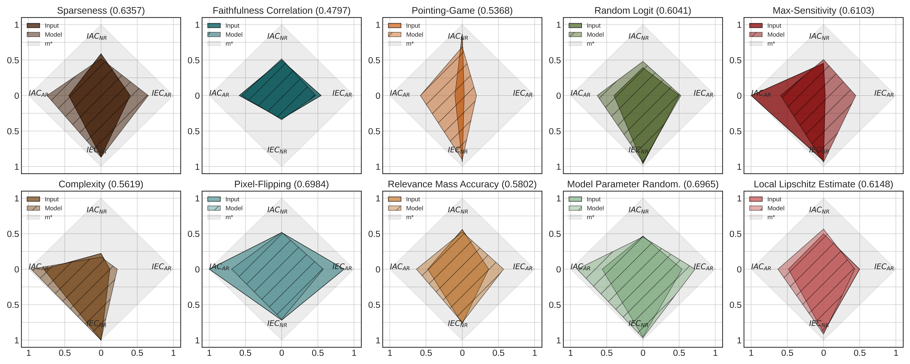

<br/><br/>
<p align="center">
  
</p>
<h3 align="center"><b>An XAI performance tool for the identification of reliable metrics</b></h3>
<p align="center">
  PyTorch
  
This repository contains the code and experimental results for the paper **[The Meta-Evaluation Problem in Explainable AI: Identifying Reliable Estimators with MetaQuantus](https://arxiv.org/abs/2302.07265)** by Hedström et al., 2023.

[](anonymous)

[](https://github.com/psf/black)
[](https://badge.fury.io/py/metaquantus)
[](https://github.com/annahedstroem/MetaQuantus/actions/workflows/python-publish.yml/badge.svg)
<!--[](anonymous)-->

_MetaQuantus is currently under active development. Carefully note the release version to ensure reproducibility of your work._

## Citation

If you find this toolkit or its companion paper interesting or useful in your research, use the following Bibtex annotation to cite us:

```bibtex
@article{hedstrom2023metaquantus,
 author = {Hedström, Anna and Bommer, Philine and Wickstrøm, Kristoffer K. and Samek, Wojciech and Lapuschkin, Sebastian and Höhne, Marina M. -C.},
  title = {The Meta-Evaluation Problem in Explainable AI: Identifying Reliable Estimators with MetaQuantus},
  doi = {10.48550/ARXIV.2302.07265},
  url = {https://arxiv.org/abs/2302.07265},
  publisher = {arXiv},
  year = {2023},
}
```


## Table of Contents
1. [Motivation](#motivation)
2. [Library](#library)
3. [Installation](#installation)
4. [Getting started](#getting-started)
5. [MetaQuantus methodology](#metaquantus-methodology)
6. [Reproduce the experiments](#reproduce-the-experiments)
  
## Motivation

**The Evaluation Disagreement Problem.** In Explainable AI (XAI), the need of meta-evaluation (i.e., the process of evaluating the evaluation method) arises as we select and quantitatively compare explanation methods for a given model, dataset and task---where the use of multiple metrics or evaluation techniques oftentimes lead to conflicting results. For example, scores from different metrics vary, both in range and direction, with lower or higher scores indicating higher quality explanations, making it difficult for practitioners to interpret the scores and select the best explanation method. 

As illustrated in the Figure below, the two metrics, Faithfulness Correlation (FC) <a href="https://www.ijcai.org/Proceedings/2020/0417.pdf">(Bhatt et al., 2020)</a> and Pixel-Flipping (PF) <a href="https://journals.plos.org/plosone/article?id=10.1371/journal.pone.0130140">(Bach et al., 2015)</a> rank the same explanation methods differently. For example, the Gradient method <a href="https://ieeexplore.ieee.org/document/488997/">(Mørch et al., 1995)</a> <a href="https://www.jmlr.org/papers/volume11/baehrens10a/baehrens10a.pdf">(Baehrens et al., 2010)</a> is both ranked the highest (R=1) and the lowest (R=3) depending on the metric used. From a practitioner's perspective, this causes confusion.

</p>
<p align="center">
  
</p>

**Our Meta-Evaluation Approach.** With [MetaQuantus](https://github.com/annahedstroem/MetaQuantus), we address the problem of meta-evaluation by providing a simple yet comprehensive framework that evaluates metrics against two failure modes: resilience to noise (NR) and reactivity to adversaries (AR). In a similar way that software systems undergo vulnerability and penetration tests before deployment, this open-sourced tool is designed to stress test evaluation methods (e.g., as provided by <a href="https://github.com/understandable-machine-intelligence-lab/Quantus">Quantus</a>).

## Library

[MetaQuantus](https://github.com/annahedstroem/MetaQuantus) is an open-source, development tool for XAI researchers and Machine Learning (ML) practitioners to verify and benchmark newly constructed metrics (i.e., ``quality estimators''). It offers an easy-to-use API that simplifies metric selection such that the explanation method selection in XAI can be performed more reliably, with minimal code. MetaQuantus includes:

- A series of pre-built tests such as `ModelPerturbationTest` and `InputPertubrationTest` that can be applied to various metrics
- Supporting source code such as for plotting and analysis
- Various tutorials e.g., [Getting-Started-with-MetaQuantus](https://github.com/annahedstroem/MetaQuantus/blob/main/tutorials/Tutorial-Getting-Started-with-MetaQuantus.ipynb) and [Reproduce-Paper-Experiments](https://github.com/annahedstroem/MetaQuantus/blob/main/tutorials/Tutorial-Reproduce-Experiments.ipynb)


## Installation

If you already have [PyTorch](https://pytorch.org/) installed on your machine, the most light-weight version of MetaQuantus can be obtained from [PyPI](https://pypi.org/project/metaquantus/):

```setup
pip install metaquantus
```

Alternatively, you can download a local copy (and then, access the folder):

```setup
git clone https://github.com/annahedstroem/MetaQuantus.git
cd MetaQuantus
```

And then install it locally:
```setup
pip install -e .
```

Alternatively, you can simply install MetaQuantus with [requirements.txt](https://github.com/understandable-machine-intelligence-lab/Quantus/blob/main/requirements.txt).

```setup
pip install -r requirements.txt
```

Note that these installation options require that [PyTorch](https://pytorch.org/) is already installed on your machine.

### Package requirements

The package requirements are as follows:
```
python>=3.7.1
pytorch>=1.10.1
quantus>=0.3.2
captum>=0.4.1
```

## Getting started

Please see [
Tutorial-Getting-Started-with-MetaQuantus.ipynb](https://github.com/annahedstroem/MetaQuantus/blob/main/tutorials/Tutorial-Getting-Started-with-MetaQuantus.ipynb) under `tutorials/` folder to get started. Note that [PyTorch](https://pytorch.org/) framework and the XAI evalaution library [Quantus](https://github.com/understandable-machine-intelligence-lab/Quantus) is needed to run [MetaQuantus](https://github.com/annahedstroem/MetaQuantus). 

<!--## MetaQuantus methodology

Meta-evaluation of quality estimators is performed in 3 steps: (1) Perturbing, (2) Scoring and (3) Integrating. 
  1. **Perturbing.** A minor or disruptive perturbation is induced depending on the failure mode: NR or AR.
  2. **Scoring.** To assess each performance dimension, the estimator’s IAC and IEC scores are calculated. 
  3. **Integrating.** We combine the IAC and IEC scores to produce an MC score that summarises the estimator’s performance.

</p>
<p align="center">
  
</p>-->

## Reproduce the paper experiments

To reproduce the results of this paper, you will need to follow these three steps:

1. **Generate the dataset.** Run the notebook [
Tutorial-Data-Generation-Experiments.ipynb](https://github.com/annahedstroem/MetaQuantus/blob/main/tutorials/Tutorial-Data-Generation-Experiments.ipynb) to generate the necessary data for the experiments. This notebook will guide you through the process of downloading and preprocessing the data in order to save it to appropriate test sets. Please store the models in a folder called `assets/models/` and the tests sets under `assets/test_sets/`.
2. **Run the experiments.** To obtain the results for the respective experiments, you have to run the respective Python scripts which are detailed below. All these Python files are located in the `scripts/` folder. If you want to run the experiments on other explanation methods, datasets or models, feel free to change the hyperparameters.
3. **Analyse the results.** Once the results are obtained for your chosen experiments, run the [Tutorial-Reproduce-Paper-Experiments.ipynb](https://github.com/annahedstroem/MetaQuantus/blob/main/tutorials/Tutorial-Reproduce-Experiments.ipynb) to analyse the results. (In the notebook itself, we have also listed which specific Python scripts that need to be run in order to obtain the results for this analysis step.)

<details>
<summary><b><normal>Additional details on step 2 (Run the Experiments)</normal></b></summary>

**Test**: Go to the root folder and run a simple test that meta-evaluation work.
```bash
python3 scripts/run_test.py --K=5 --iters=10 --dataset=MNIST
```

**Application**: Run the benchmarking experiments (also used for category convergence analysis).
```bash
python3 scripts/run_benchmarking.py --dataset=MNIST --fname=f --K=5 --iters=3
python3 scripts/run_benchmarking.py --dataset=fMNIST --fname=f --K=5 --iters=3
python3 scripts/run_benchmarking.py --dataset=cMNIST --fname=f --K=5 --iters=3
python3 scripts/run_benchmarking.py --dataset=ImageNet --fname=ResNet18 --K=5 --iters=3 --batch_size=50 --start_idx_fixed=100 --end_idx_fixed=150 --reverse_order=False --folder=benchmarks_imagenet/ --PATH_ASSETS=../assets/ --PATH_RESULTS=results/
```

**Application**: Run hyperparameter optimisation experiment.
```bash
python3 scripts/run_hp.py --dataset=MNIST --K=3 --iters=2 --PATH_ASSETS=../assets/ --PATH_RESULTS=results/
python3 scripts/run_hp.py --dataset=ImageNet --K=3 --iters=2 --PATH_ASSETS=../assets/ --PATH_RESULTS=results/
```

**Experiment**: Run the faithfulness ranking disagreement exercise.
```bash
python3 scripts/run_ranking.py --dataset=cMNIST --fname=f --K=5 --iters=3 --category=Faithfulness --PATH_ASSETS=../assets/ --PATH_RESULTS=results/
```

**Sanity-Check**: Run sanity-checking exercise: adversarial estimators.
```bash
python3 scripts/run_sanity_checks.py --dataset=ImageNet --K=3 --iters=2 --PATH_ASSETS=../assets/ --PATH_RESULTS=results/
```

**Sanity-Check**: Run sanity-checking exercise: L dependency.
```bash
python3 scripts/run_l_dependency.py --dataset=MNIST --K=5 --iters=3 --PATH_ASSETS=../assets/ --PATH_RESULTS=results/
python3 scripts/run_l_dependency.py --dataset=fMNIST --K=5 --iters=3 --PATH_ASSETS=../assets/ --PATH_RESULTS=results/
python3 scripts/run_l_dependency.py --dataset=cMNIST --K=5 --iters=3 --PATH_ASSETS=../assets/ --PATH_RESULTS=results/
```

**Benchmarking Transformers**: Run transformer benchmarking experiment.
```bash
python3 scripts/run_benchmarking_transformers.py --dataset=ImageNet --K=5 --iters=3 --start_idx=0 --end_idx=40 --category=localisation --PATH_ASSETS=../assets/ --PATH_RESULTS=results/
python3 scripts/run_benchmarking_transformers.py --dataset=ImageNet --K=5 --iters=3 --start_idx=40 --end_idx=80 --category=localisation --PATH_ASSETS=../assets/ --PATH_RESULTS=results/
python3 scripts/run_benchmarking_transformers.py --dataset=ImageNet --K=5 --iters=3 --start_idx=80 --end_idx=120 --category=localisation --PATH_ASSETS=../assets/ --PATH_RESULTS=results/
python3 scripts/run_benchmarking_transformers.py --dataset=ImageNet --K=5 --iters=3 --start_idx=120 --end_idx=160 --category=localisation --PATH_ASSETS=../assets/ --PATH_RESULTS=results/
```

```bash
python3 scripts/run_benchmarking_transformers.py --dataset=ImageNet --K=5 --iters=3 --start_idx=40 --end_idx=80 --category=complexity --PATH_ASSETS=../assets/ --PATH_RESULTS=results/
python3 scripts/run_benchmarking_transformers.py --dataset=ImageNet --K=5 --iters=3 --start_idx=0 --end_idx=40 --category=complexity --PATH_ASSETS=../assets/ --PATH_RESULTS=results/
python3 scripts/run_benchmarking_transformers.py --dataset=ImageNet --K=5 --iters=3 --start_idx=80 --end_idx=120 --category=complexity --PATH_ASSETS=../assets/ --PATH_RESULTS=results/
python3 scripts/run_benchmarking_transformers.py --dataset=ImageNet --K=5 --iters=3 --start_idx=120 --end_idx=160 --category=complexity --PATH_ASSETS=../assets/ --PATH_RESULTS=results/
```
</details>

**Note.** For all steps, please make sure to adjust any local paths so that the approriate files can be retrieved. Make sure to have all the necessary packages installed as well as ensure to have GPUs enabled throughout the computing as this will speed up the experimentation considerably. Also, note that the results may vary slightly depending on the random seed and other hyperparameters of the experiments. Nonetheless, the overall trends and conclusions should remain the same as in the paper.

<!--https://raw.githubusercontent.com/annahedstroem/MetaQuantus/main/
<p align="center">
  
</p>
<p><small>
*Meta-evaluation benchmarking results with cMNIST, aggregated over 3 iterations with $K=5$. IPT results are in grey rows and MPT results are in white rows. $\overline{\text{MC}}$ denotes the averages of the MC scores over IPT and MPT. The top-performing $\text{MC}$- or $\overline{\text{MC}}$ method in each explanation category, which outperforms the bottom-performing method by at least 2 standard deviations, is underlined. Higher values are preferred for all scoring criteria.*
</small></p>-->

Currently, the experiments are limited to the following experimental combinations:
* XAI methods: any method provided by querying `quantus.AVAILABLE_XAI_METHODS_CAPTUM`
* XAI metrics: any metric provided by querying `quantus.AVAILABLE_METRICS`
* Models: any `PyTorch` model (i.e., `torch.nn.module`)
* Datasets: `MNIST`, `fMNSIT`, `cMNIST` and `ImageNet`

Please feel free to raise an [Issue](https://github.com/annahedstroem/MetaQuantus/issues) if you'd like to extend these set-ups.
