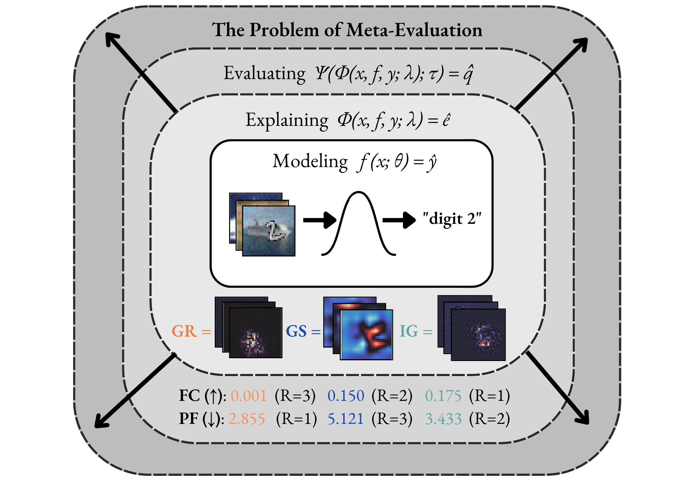
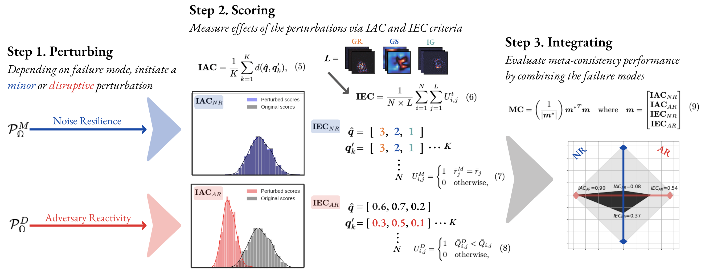

<br/><br/>
<p align="center">
  
</p>
<!--<h1 align="center"><b>MetaQuantus</b></h1>-->
<h3 align="center"><b>A XAI performance tool for identifying reliable metrics</b></h3>
<p align="center">
  PyTorch
  
This repository contains the code and experimental results for the paper [The Meta-Evaluation Problem in Explainable AI: Identifying Reliable Estimators with MetaQuantus](anonymous). 

[](anonymous)

[](https://github.com/psf/black)
<!--[](anonymous)-->
<!--[](https://github.com/understandable-machine-intelligence-lab/Quantus/actions/workflows/python-package.yml)-->
<!--[](https://badge.fury.io/py/metaquantus)-->

_MetaQuantus is currently under active development. Carefully note the release version to ensure reproducibility of your work._

## Table of Contents
1. [Motivation](#motivation)
2. [Library](#library)
3. [Installation](#installation)
4. [Getting started](#getting-started)
5. [MetaQuantus methodology](#metaquantus-methodology)
6. [Reproduce the experiments](#reproduce-the-experiments)
  
## Motivation

In Explainable AI (XAI), the problem of meta-evaluation (i.e., the process of evaluating the evaluation method itself) arises as we select and quantitatively compare explanation methods for a given model, dataset and task---where the use of multiple metrics or evaluation techniques oftentimes lead to conflicting results. For example, scores from different metrics vary, both in range and direction, with lower or higher scores indicating higher quality explanations, making it difficult for practitioners to interpret the scores and select the best explanation method. 

As illustrated in the Figure below, the two metrics, Faithfulness Correlation (FC) <a href="https://www.ijcai.org/Proceedings/2020/0417.pdf">(Bhatt et al., 2020)</a> and Pixel-Flipping (PF) <a href="https://journals.plos.org/plosone/article?id=10.1371/journal.pone.0130140">(Bach et al., 2015)</a> rank the same explanation methods differently. For example, the Gradient method <a href="https://ieeexplore.ieee.org/document/488997/">(Mørch et al., 1995)</a> <a href="https://www.jmlr.org/papers/volume11/baehrens10a/baehrens10a.pdf">(Baehrens et al., 2010)</a> is both ranked the highest (R=1) and the lowest (R=3) depending on the metric used. From a practitioner's perspective, this causes confusion.

</p>
<p align="center">
  
</p>

With MetaQuantus, we address the problem of meta-evaluation by providing a simple yet comprehensive framework that evaluates metrics against two failure modes: resilience to noise (NR) and reactivity to adversaries (AR). In a similar way that software systems undergo vulnerability and penetration tests before deployment, this open-sourced tool is designed to stress test evalaution methods (e.g., as provided by <a href="https://github.com/understandable-machine-intelligence-lab/Quantus">Quantus</a>).

## Library

MetaQuantus is an open-source, general-purpose tool that serves as a development tool for XAI researchers and Machine Learning (ML) practitioners to verify and benchmark newly constructed metrics (i.e., ``quality estimators''). It offers an easy-to-use API that simplifies metric selection such that the explanation method selection in XAI can be performed more reliably, with minimal code. MetaQuantus includes:

- A series of pre-built tests such as `ModelPerturbationTest` and `InputPertubrationTest` that can be applied to various metrics
- Supporting source code such as for plotting and analysis
- Various tutorials e.g., [Getting-Started-with-MetaQuantus](anonymous) and [Reproduce-Experiments](anonymous)


## Installation

The simplest way to install MetaQuantus is to download a local copy (and then, access the folder):

```setup
git clone https://github.com/anonymous/MetaQuantus.git
cd MetaQuantus
```

And then install it locally:
```setup
pip install -e .
```

Alternatively, you can simply install MetaQuantus with [requirements.txt](https://github.com/understandable-machine-intelligence-lab/Quantus/blob/main/requirements.txt).

```setup
pip install -r requirements.txt
```

<!--Alternatively, another light-weight version of MetaQuantus can be obtained from [PyPI](https://pypi.org/project/metaquantus/) as follows:

```setup
pip install metaquantus
```
-->

Note that the installation requires that [PyTorch](https://pytorch.org/) is already installed on your machine.

### Package requirements

The package requirements are as follows:
```
python>=3.7.0
pytorch>=1.10.1
quantus>=0.3.2
captum>=0.4.1
```

## Getting started

Please see [
Tutorial-Getting-Started-with-MetaQuantus.ipynb](anonymous) under `tutorials/` folder to run code similar to the example given above. Note that [PyTorch](https://pytorch.org/) framework and the XAI evalaution library [Quantus](https://github.com/understandable-machine-intelligence-lab/Quantus) is needed to run `MetaQuantus`. 

## MetaQuantus methodology

Meta-evaluation of quality estimators is performed in 3 steps: (1) Perturbing, (2) Scoring and (3) Integrating. 
  1. **Perturbing.** A minor or disruptive perturbation is induced depending on the failure mode: NR or AR.
  2. **Scoring.** To assess each performance dimension, the estimator’s IAC and IEC scores are calculated. 
  3. **Integrating.** We combine the IAC and IEC scores to produce an MC score that summarises the estimator’s performance.

</p>
<p align="center">
  
</p>

## Reproduce the experiments

To reproduce the results of this paper, you will need to follow these steps:

1. **Dataset Generation**: Run the notebook [
Tutorial-Data-Generation-Experiments.ipynb](anonymous) to generate the necessary data for the experiments. This notebook will guide you through the process of downloading and preprocessing the data in order to save it to approriate test sets.

2. **Results Analysis**: Once the dataset generation step is complete, run the [Tutorial-Reproduce-Experiments.ipynb](anonymous) to produce and analyse the results. Inside the notebook, for each experiment, we will describe which python scripts to run in order to obtain the results. All these python files are located in the `scripts/` folder. Please note that the results may slightly vary depending on the random seed and other hyperparameters, but the overall trends and conclusions should remain the same.

For both steps, make sure to adjust local paths so that the approriate files can be retrieved including having all the necessary packages installed. Ensure to have GPUs enabled throughout the computing as this will speed up the experimentation considerably. 

<details>
<summary><b><big>More details on how to run the scripts for step 2.</big></b></summary>

In the second step, you have to run the python scripts for the respective experiment as listed below (it is also referenced in the notebook). Feel free to change the hyperparameters if you want to run similar experiments on other explanation methods, datasets or models. 

**Test**: Run a simple test that meta-evaluation work.
```bash
python3 run_test.py --dataset=ImageNet --K=3 --iters=2
```

**Application**: Run the benchmarking experiments (also used for category convergence analysis).
```bash
python3 run_benchmarking.py --dataset=MNIST --fname=f --K=5 --iters=3
python3 run_benchmarking.py --dataset=fMNIST --fname=f --K=5 --iters=3
python3 run_benchmarking.py --dataset=cMNIST --fname=f --K=5 --iters=3
```

**Application**: Run hyperparameter optimisation experiment.
```bash
python3 run_hp.py --dataset=MNIST --K=3 --iters=2
python3 run_hp.py --dataset=ImageNet --K=3 --iters=2
```

**Experiment**: Run the faithfulness ranking disagreement exercise.
```bash
python3 run_ranking.py --dataset=cMNIST --fname=f --K=5 --iters=3 --category=Faithfulness
```

**Sanity-Check**: Run sanity-checking exercise: L dependency.
```bash
python3 run_l_dependency.py --dataset=MNIST --K=5 --iters=3
python3 run_l_dependency.py --dataset=fMNIST --K=5 --iters=3
python3 run_l_dependency.py --dataset=cMNIST --K=5 --iters=3
```

**Sanity-Check**: Run sanity-checking exercise: adversarial estimators.
```bash
python3 run_hp.py --dataset=MNIST --K=3 --iters=2
python3 run_sanity_checks.py --dataset=ImageNet --K=3 --iters=2
```

</details>
